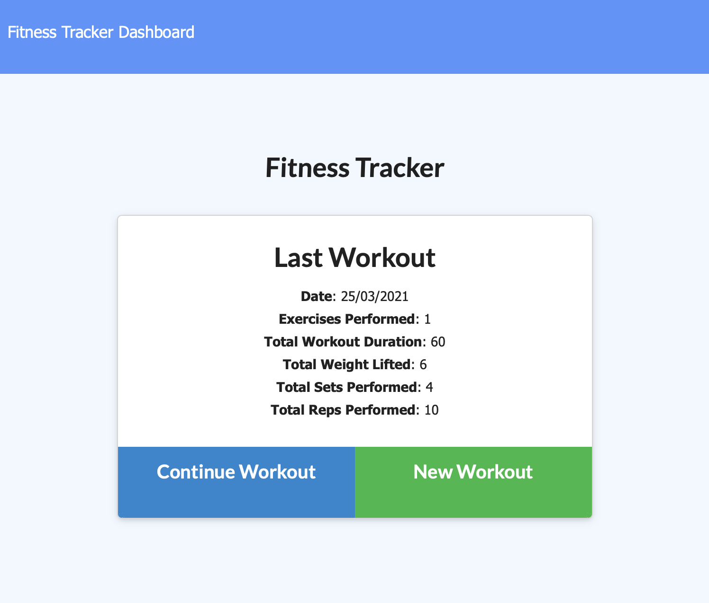
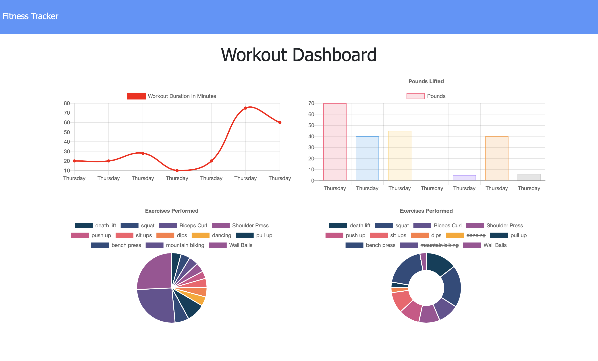

# Workout Tracker

  ## Description
  

  Add exercises and keep track of your workouts to improve your performance. 

Deployed app :link: 

Github repository :link: https://github.com/avpizarro/workoutTracker.git
  
  

  

  ## Table of Contents

  * [Installation](#installation)
  * [Usage](#usage)
  * [License](#license)
  * [Questions](#questions)

  ## Installation
  Visit this link to start ussing the app :link:

  ## Usage

  Start by clicking the New Workout option and choose if you want to add resistance or cardio exercises. If you choose resistance you will be prompted to add a name, weight, sets, reps and duration for each exercise. A cardio exercise will require distance and duration. Visit the Dashboard where the total durations and pounds lifted for the last seven workouts will be displayed. As well as the duration and weight lifted per exercise.

  ## License
  This Source Code Form is subject to the terms of the MIT License. 
  If a copy of the License was not distributed with this file, You can obtain one at https://opensource.org/licenses

  ## Questions
  For further information please visit my GitHub page:
  https://github.com/avpizarro

  Or email me directly :e-mail: avpizarro@live.com
  